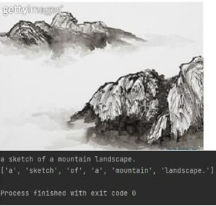
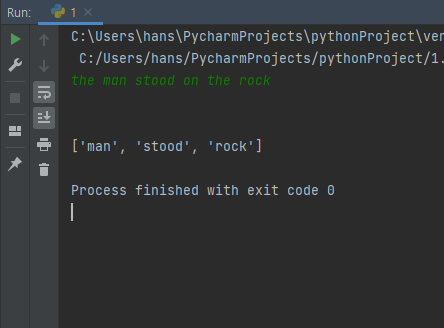

## 2022 Summer Sillicon Valley Internship Program

# Team E
- 김한규_단국대 : 리더, AI, Design
- 박지은_이화여대: BackEnd, Design
- 백승민_이화여대: AI, DB
- 신재용_재능대: BackEnd, DB
- 유효주_이화여대: FrontEnd, DB

### 프로젝트명: YeZak
프로젝트 한줄 소개: 미대생 예작 판매 웹사이트

## WEB 파트
내용 추가 필요

## AI 파트

#### Resnet 18

###### DATASET

###### LABELING
<td></td>
<!--  -->
###### MODEL STRUCTURE

###### CLIP Model

<td></td>
<td></td>

<!--

**Here are some ideas to get you started:**

🙋‍♀️ A short introduction - what is your organization all about?
🌈 Contribution guidelines - how can the community get involved?
👩‍💻 Useful resources - where can the community find your docs? Is there anything else the community should know?
🍿 Fun facts - what does your team eat for breakfast?
🧙 Remember, you can do mighty things with the power of [Markdown](https://docs.github.com/github/writing-on-github/getting-started-with-writing-and-formatting-on-github/basic-writing-and-formatting-syntax)
-->
